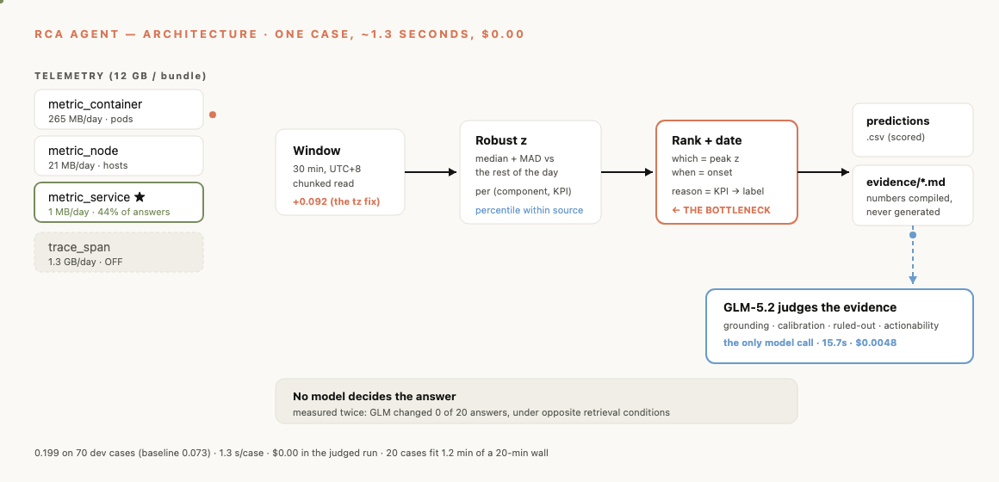
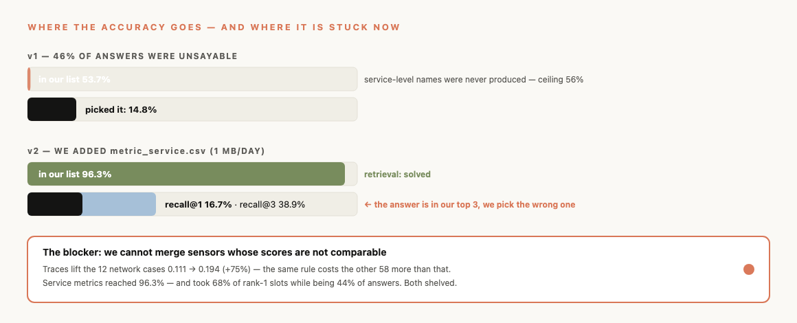

# Coach brief — 2 minutes to read

> **See it animated:** `make webapp` → **[How it works](http://127.0.0.1:8100/architecture)** ·
> **[Presentation](http://127.0.0.1:8100/presentation)** · **[Console](http://127.0.0.1:8100/)**
> — the SVGs below animate live there; GitHub shows them as stills.

## What we built

A **deterministic detector**, no model in the judged path.

For each `(component, KPI)` series: compare the 30-minute incident window against the
rest of that day using a robust z-score (median + MAD, so one spike can't set the
scale). Rank components by peak z. Date the fault at the **onset** — the first sample
to leave the band — not the peak. Compile the evidence file from those measured values.

**Score: 0.199 on all 70 dev cases, up from the 0.073 baseline. 1.3 s/case, $0.00.**

## Why no LLM in the judged run

We measured it twice, under **opposite** conditions:

| | |
|---|---|
| GLM-5.2, reasoning on, given our ranked candidate table | **changed 0 of 20 answers** |
| Same, after we fixed the table (answer present 96% vs 54%) | **changed 0 of 20 again** |

It isn't information-starved. Handed a **sorted** list it takes row one and writes a
justification — it anchors on our ordering. Cost of keeping it: 8.2 min of a 20-min
budget, for zero change.

So GLM sits where there is **no deterministic scorer**: grading our free-text evidence
(`webapp/` → `POST /api/judge`). Accuracy already has OpenRCA's `evaluate`. Evidence
quality had nothing but our own assertion.

## The bottleneck, precisely

**It is re-ranking. Retrieval is solved.**

| | v1 | v2 (service sensor added) |
|---|---|---|
| True component anywhere in our list | 53.7% | **96.3%** |
| recall@1 | 14.8% | 16.7% |
| **recall@3** | — | **38.9%** |

The answer is in our top three **39% of the time** and we pick the wrong one of the
three. Per-element accuracy: time 27%, **component 15%**, reason 24%.

**And the thing blocking us from using our better sensors is one unsolved problem:**
we cannot combine evidence across sources whose scores are not comparable. It has now
killed two separate improvements:

- **Traces** lift the 12 network cases 0.111 → 0.194 (**+75%**) — and the same rule
  costs the other 58 cases more than that, so overall drops.
- **Service metrics** raised reachability to 96.3% — and services took **68% of rank-1
  slots** while being 44% of answers, so overall dropped 0.199 → 0.151.

Both times: a new view that genuinely sees something, thrown away because the merge
rule is too blunt. Percentile-within-source normalisation recovered part of it (0.169)
but is still below v1.

---

# 5 questions for the coaches

**1. How should we merge evidence from sensors whose scores aren't comparable?**
This is the whole blocker. A z from CPU-seconds, a z from request-rate, and a p95 span
gap are different quantities. Ranking them against each other lets the loudest sensor
win rather than the right one. Is there a standard approach here — calibrate each
source to a probability, learn per-source weights, or a decision rule that picks *which
sensor should decide this case* before ranking within it?

**2. Can the question tell us which LEVEL the answer is at?**
Ground truth is 44% service, 37% node, 19% pod. If the instruction's phrasing or task
type predicts that, we can route to one sensor and stop competing across them. Is that
signal there, or is level genuinely unknowable from the question?

**3. When a pod fails, when is the labelled answer the pod and when is it the service?**
We need the labelling convention. It decides whether we should aggregate pod anomalies
up to their service, or keep them separate and choose.

**4. On the held-out deployment, what stays the same?**
Component names change — we've gated against hardcoding them. But do the **7 task
types, the 15 reasons, and the ~44/37/19 level split** hold? That determines how much
structure we're allowed to rely on versus what counts as overfitting.

**5. The published RCA-Agent gets ~11% strict. What is its retrieval doing that ours isn't?**
We beat it on this split, but we suspect it queries telemetry iteratively rather than
reading a fixed window. **We never gave our model tools to ask its own next question** —
that's the one experiment we haven't run, and we'd like to know if it's where the
remaining headroom is.

---

## If we get one answer, make it #1

Two measured improvements are sitting on the shelf because of it. Unblocking the merge
rule converts **+75% on network cases** and **96.3% reachability** from findings into
score.
